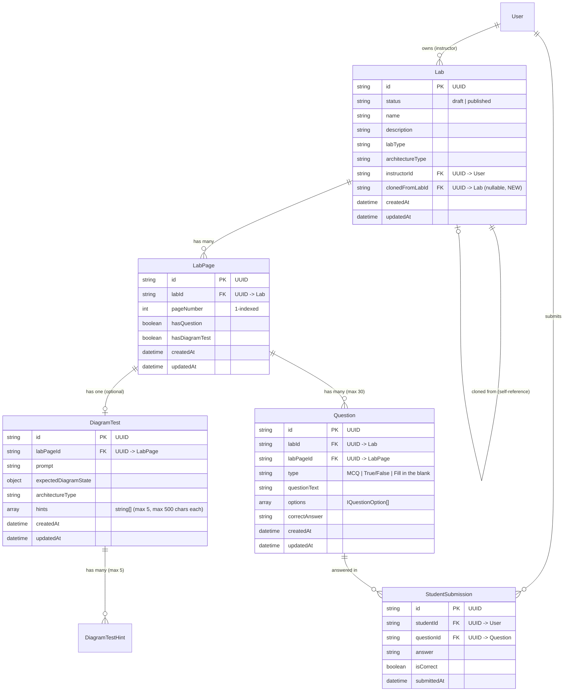
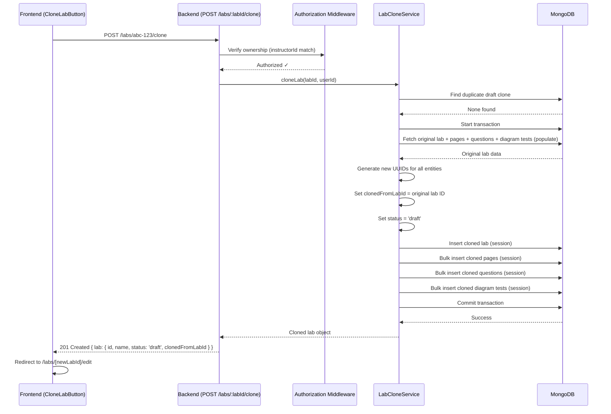
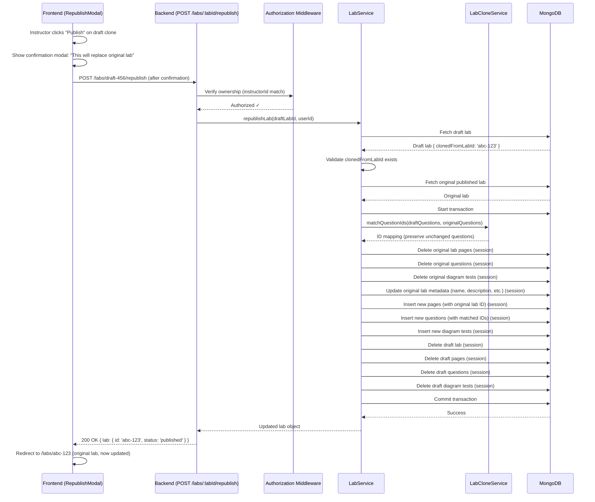
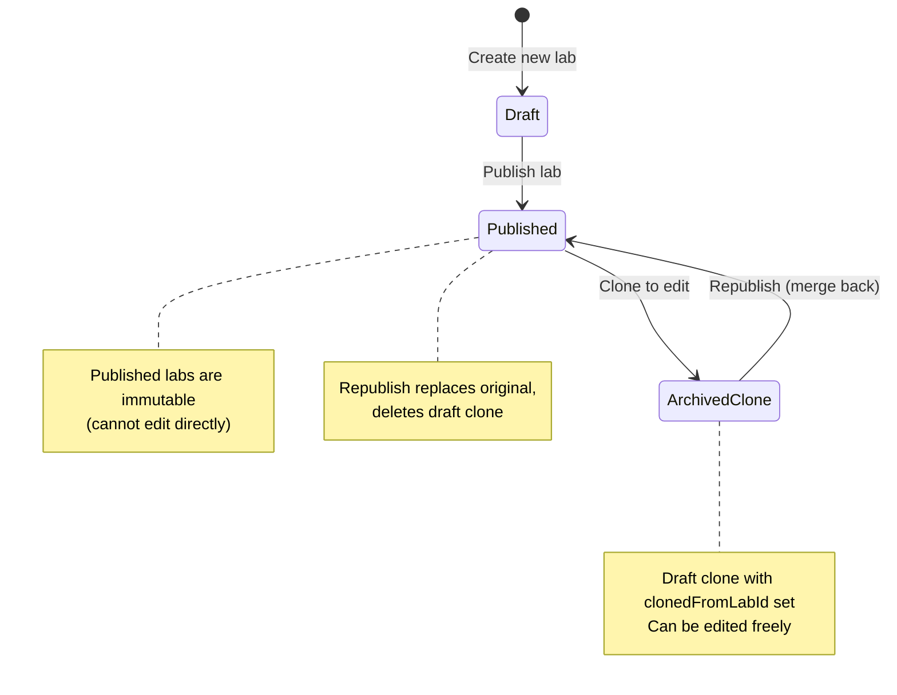
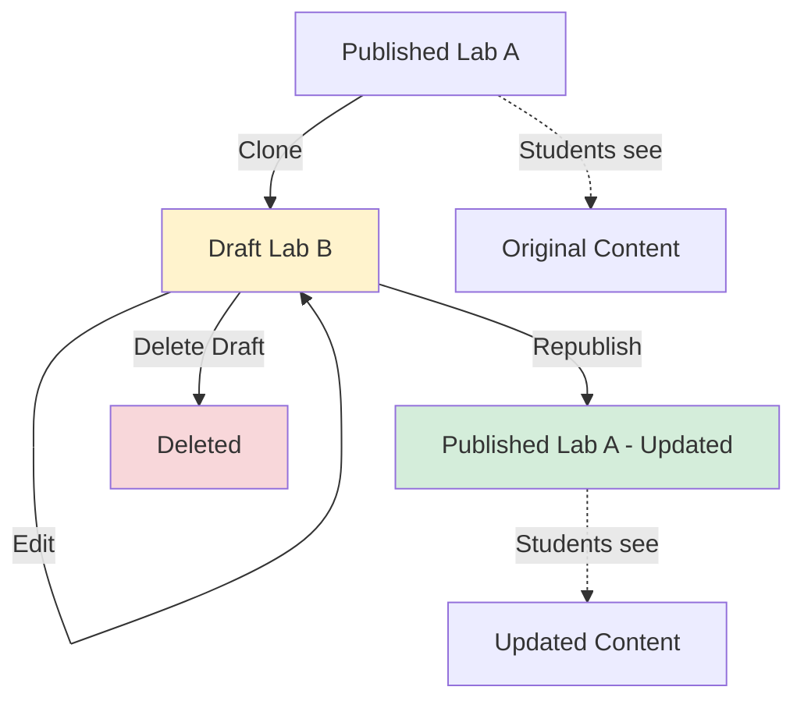

# Data Model: Clone Published Lab to Edit

**Feature**: 001-clone-lab-to-edit  
**Date**: 2025-01-17  
**Status**: Complete

## Overview

This document defines the data model changes required to support cloning published labs to editable drafts and republishing them to replace the original. It includes schema modifications, entity relationships, and data flow diagrams.

---

## 1. Entity-Relationship Diagram



---

## 2. Schema Changes

### 2.1 Lab Model (MODIFY)

**File**: `/Users/arjun/whatsnxt-bff/app/models/lab/Lab.ts`

**New Field**:
```typescript
export interface ILab extends Document {
  id: string;
  status: "draft" | "published";
  name: string;
  description?: string;
  labType: string;
  architectureType: string;
  instructorId: string;
  associatedCourses?: string[];
  pricing?: { /* existing */ };
  
  // NEW: Clone tracking
  clonedFromLabId?: string; // UUID of original published lab (null if not a clone)
  
  createdAt: Date;
  updatedAt: Date;
}
```

**Mongoose Schema Addition**:
```typescript
const LabSchema = new Schema<ILab>({
  // ... existing fields ...
  
  clonedFromLabId: {
    type: String,
    required: false,
    default: null,
    index: true, // For fast lookup of drafts by original lab
    validate: {
      validator: async function(this: ILab, value: string | null) {
        if (!value) return true; // Null is allowed
        
        // Validate referenced lab exists
        const originalLab = await LabModel.findOne({ id: value });
        if (!originalLab) {
          throw new Error('clonedFromLabId must reference an existing lab');
        }
        
        // Validate it references a published lab
        if (originalLab.status !== 'published') {
          throw new Error('clonedFromLabId must reference a published lab');
        }
        
        return true;
      },
      message: 'Invalid clonedFromLabId'
    }
  }
}, { timestamps: true });

// NEW INDEX: Fast lookup for "find draft clone of published lab X"
LabSchema.index({ clonedFromLabId: 1, status: 1, instructorId: 1 });
```

**Static Methods (NEW)**:
```typescript
// Find active draft clone of a published lab
LabSchema.statics.findDraftClone = function(originalLabId: string, instructorId: string) {
  return this.findOne({
    clonedFromLabId: originalLabId,
    status: 'draft',
    instructorId
  });
};

// Check if published lab has an active draft clone
LabSchema.statics.hasDraftClone = async function(labId: string, instructorId: string) {
  const count = await this.countDocuments({
    clonedFromLabId: labId,
    status: 'draft',
    instructorId
  });
  return count > 0;
};
```

**Migration**: Existing labs will have `clonedFromLabId: null` (default). No backfill required.

---

### 2.2 Other Models (NO CHANGES)

**LabPage, Question, DiagramTest**: No schema changes required. These models are cloned as-is with new UUIDs.

**StudentSubmission** (assumed structure):
```typescript
// NO CHANGES - existing model
export interface IStudentSubmission extends Document {
  id: string;
  studentId: string;
  questionId: string; // References Question.id (preserved during republish)
  answer: string;
  isCorrect: boolean;
  submittedAt: Date;
}
```

**Key Insight**: Student progress preservation works through question ID matching (see Research section 4). No schema changes needed.

---

## 3. Data Flow Diagrams

### 3.1 Clone Operation Flow



**Key Points**:
- Transaction ensures atomicity (all entities cloned or none)
- Duplicate check happens before transaction (fast fail)
- Bulk inserts optimize performance (batch operations)
- All IDs are new UUIDs (except preserved during republish)

---

### 3.2 Republish Operation Flow



**Key Points**:
- Confirmation modal prevents accidental replacement
- Question ID matching preserves student progress (see section 4)
- Draft is deleted after successful republish (cleanup)
- Original lab ID is preserved (students' links don't break)
- Transaction ensures atomicity (original not corrupted on failure)

---

## 4. Question ID Preservation Strategy

### Problem
When an instructor republishes a draft, new Question documents are created. If all questions get new IDs, students lose progress on unchanged questions.

### Solution: Exact Match Preservation

**Algorithm**:
```typescript
interface QuestionMatch {
  draftQuestion: IQuestion;
  preservedId: string; // Original ID if match, else new UUID
}

function matchQuestionIds(
  draftQuestions: IQuestion[], 
  originalQuestions: IQuestion[]
): QuestionMatch[] {
  return draftQuestions.map(draftQ => {
    // Find exact match in original questions
    const originalMatch = originalQuestions.find(origQ =>
      origQ.questionText.trim() === draftQ.questionText.trim() &&
      origQ.type === draftQ.type &&
      origQ.correctAnswer.trim() === draftQ.correctAnswer.trim() &&
      JSON.stringify(origQ.options) === JSON.stringify(draftQ.options) // Deep equality
    );

    return {
      draftQuestion: draftQ,
      preservedId: originalMatch ? originalMatch.id : uuidv4() // Reuse or generate new
    };
  });
}
```

**Example**:

| Scenario | Original Question | Draft Question | Result |
|----------|------------------|----------------|--------|
| Unchanged | `{ id: 'q1', text: 'What is AWS?' }` | `{ id: 'q1-draft', text: 'What is AWS?' }` | Use original ID `q1` → Progress preserved |
| Edited | `{ id: 'q2', text: 'What is S3?' }` | `{ id: 'q2-draft', text: 'What is Amazon S3?' }` | Generate new ID `q2-new` → Progress lost |
| Deleted | `{ id: 'q3', text: '...' }` | (not in draft) | No new question → Progress archived (StudentSubmission still references q3) |
| Added | (not in original) | `{ id: 'q4-draft', text: 'New question' }` | Generate new ID `q4-new` → No prior progress |

**Benefits**:
- Simple and predictable
- No complex fuzzy matching
- Preserves progress for typo fixes (if instructor re-types exactly)
- Acceptable trade-off: Edited questions lose progress (expected behavior)

**Limitations**:
- Minor edits (rephrasing) lose progress
- Future enhancement: Fuzzy matching with instructor confirmation

---

## 5. Indexes and Performance

### Existing Indexes (Unchanged)
```typescript
// Lab
LabSchema.index({ instructorId: 1 });
LabSchema.index({ status: 1 });
LabSchema.index({ instructorId: 1, status: 1 }); // Composite

// LabPage
LabPageSchema.index({ labId: 1, pageNumber: 1 }, { unique: true });

// Question
QuestionSchema.index({ labPageId: 1 });
QuestionSchema.index({ labId: 1 });

// DiagramTest
DiagramTestSchema.index({ labPageId: 1 });
```

### New Indexes
```typescript
// Lab - for finding draft clones
LabSchema.index({ clonedFromLabId: 1, status: 1, instructorId: 1 });
```

**Query Patterns**:
1. **Find draft clone**: `{ clonedFromLabId: 'abc-123', status: 'draft', instructorId: 'user-1' }`
   - Uses new composite index (fast)
2. **Clone lab (fetch all data)**: `Lab.findByUUID().populate('pages.questions', 'pages.diagramTest')`
   - Uses existing indexes on labId, labPageId
3. **Republish (bulk delete)**: `deleteMany({ labId: 'abc-123' })`
   - Uses existing labId index

**Expected Performance**:
- Duplicate check: <10ms (indexed query)
- Clone fetch: ~500ms (populate with 20 pages, 100 questions)
- Bulk inserts: ~1.5s (4 collections, batched)
- Total clone time: ~2.5s (well under 10s goal)

---

## 6. Data Integrity Constraints

### Foreign Key Relationships (Enforced by Application)
- `Lab.instructorId` → `User.id` (validated by auth middleware)
- `Lab.clonedFromLabId` → `Lab.id` (validated by schema validator)
- `LabPage.labId` → `Lab.id` (enforced by service layer)
- `Question.labPageId` → `LabPage.id` (enforced by service layer)
- `DiagramTest.labPageId` → `LabPage.id` (enforced by service layer)

### Validation Rules
1. **clonedFromLabId**:
   - Must reference a published lab (not draft)
   - Nullable (null for original labs, populated for clones)
   - Immutable (set once during clone, never changed)

2. **Lab Status Transitions**:
   - `draft` → `published`: Allowed (normal publish)
   - `published` → `draft`: NOT allowed (use clone instead)
   - Clone always creates `draft`
   - Republish updates original `published` lab

3. **Ownership**:
   - Only lab owner (`instructorId`) can clone or republish
   - Enforced by middleware + service layer (defense in depth)

---

## 7. Data Migration

### Existing Labs (No Migration Required)
- All existing labs will have `clonedFromLabId: null`
- Default value handles backward compatibility
- No database migration script needed

### Rollback Plan
If feature needs to be rolled back:
1. Remove `clonedFromLabId` field from schema (optional - nullable so can be ignored)
2. Drop index: `db.lab_diagram_tests.dropIndex({ clonedFromLabId: 1, status: 1, instructorId: 1 })`
3. No data loss (field can remain in documents, will be ignored)

---

## 8. Entity Lifecycle Diagrams

### Lab State Machine



### Clone Lifecycle



---

## 9. Sample Data

### Original Published Lab
```json
{
  "id": "lab-abc-123",
  "status": "published",
  "name": "AWS Basics",
  "description": "Introduction to AWS services",
  "labType": "Cloud Computing",
  "architectureType": "AWS",
  "instructorId": "instructor-001",
  "clonedFromLabId": null,
  "createdAt": "2025-01-01T00:00:00Z",
  "updatedAt": "2025-01-01T00:00:00Z"
}
```

### Cloned Draft Lab
```json
{
  "id": "lab-xyz-789", // NEW UUID
  "status": "draft", // Changed to draft
  "name": "AWS Basics", // Same metadata
  "description": "Introduction to AWS services",
  "labType": "Cloud Computing",
  "architectureType": "AWS",
  "instructorId": "instructor-001", // Same owner
  "clonedFromLabId": "lab-abc-123", // LINK to original
  "createdAt": "2025-01-17T10:00:00Z", // New timestamps
  "updatedAt": "2025-01-17T10:00:00Z"
}
```

### After Republish (Original Lab Updated)
```json
{
  "id": "lab-abc-123", // SAME ID (preserves student links)
  "status": "published", // Still published
  "name": "AWS Basics - Updated", // Updated metadata
  "description": "Introduction to AWS services with new content",
  "labType": "Cloud Computing",
  "architectureType": "AWS",
  "instructorId": "instructor-001",
  "clonedFromLabId": null, // Not a clone
  "createdAt": "2025-01-01T00:00:00Z", // Original creation date
  "updatedAt": "2025-01-17T11:00:00Z" // Updated timestamp
}
```

**Note**: Draft `lab-xyz-789` is deleted after successful republish.

---

## 10. API Data Contracts (Summary)

Detailed OpenAPI specs in `contracts/clone.json` and `contracts/republish.json`.

### Clone Endpoint
**Request**: `POST /api/labs/:labId/clone`
- Path param: `labId` (UUID of published lab)
- Headers: `Authorization: Bearer <token>`

**Response**: `201 Created`
```json
{
  "success": true,
  "data": {
    "lab": {
      "id": "lab-xyz-789",
      "status": "draft",
      "clonedFromLabId": "lab-abc-123",
      "name": "AWS Basics",
      // ... rest of lab data
    }
  }
}
```

### Republish Endpoint
**Request**: `POST /api/labs/:labId/republish`
- Path param: `labId` (UUID of draft lab)
- Headers: `Authorization: Bearer <token>`

**Response**: `200 OK`
```json
{
  "success": true,
  "data": {
    "lab": {
      "id": "lab-abc-123", // Original lab ID
      "status": "published",
      "clonedFromLabId": null,
      // ... updated lab data
    }
  }
}
```

---

## Summary

### Schema Changes
- **Lab Model**: Add `clonedFromLabId` field + index
- **Other Models**: No changes

### Key Design Decisions
1. **Clone Tracking**: Self-referential foreign key (`clonedFromLabId`)
2. **Student Progress**: Question ID matching (exact equality)
3. **Atomicity**: MongoDB transactions (all-or-nothing)
4. **Performance**: Batch inserts + parallel fetches (~2.5s for 100 questions)
5. **Authorization**: Middleware + service-level checks

### Data Integrity
- Transactions prevent partial clones/republishes
- Validation ensures `clonedFromLabId` references published labs
- Indexes enable fast duplicate detection (<10ms)

Ready for implementation. See `contracts/` for full API specifications.
