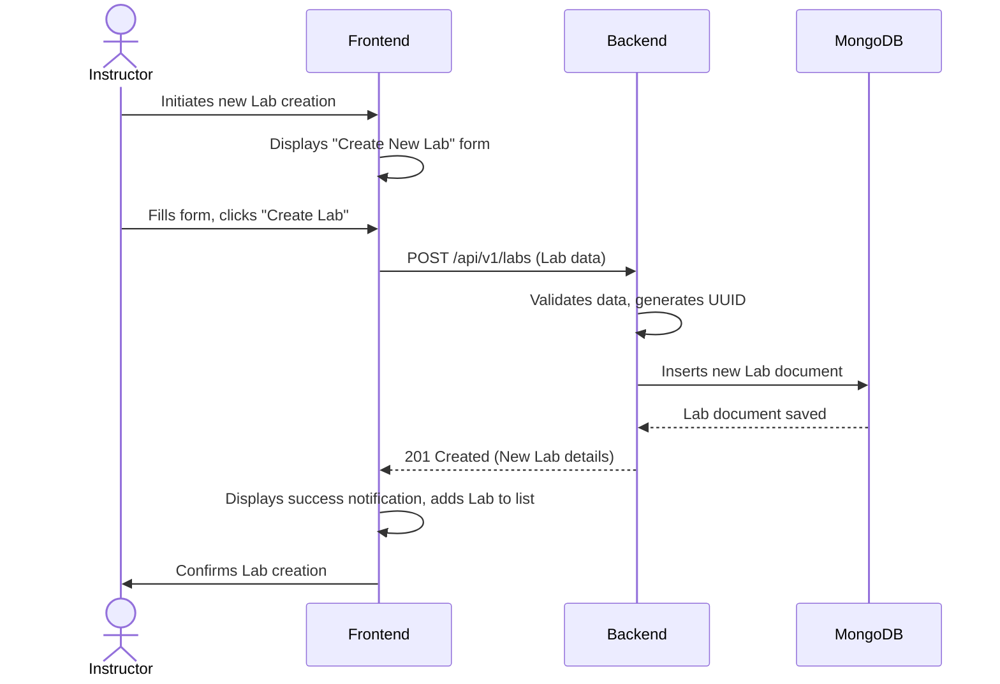

# High-Level Design (HLD): Lab Diagram Tests Feature

## 1. Introduction

This document provides a high-level overview of the architecture for the Lab Diagram Tests feature, outlining the main components and their interactions.

## 2. System Context

The Lab Diagram Tests feature will be integrated into the existing WhatsNxt Microfrontend (MFE) ecosystem. It involves both frontend (Next.js) and backend (Express.js) components, leveraging shared utilities and services within the monorepo.

## 3. Component Diagram

```mermaid
graph TD
    User[Web Browser] -- "Interact with UI" --> Frontend[Next.js App (apps/web)]
    Frontend -- "API Calls (HTTPS)" --> Backend[Express.js App (apps/whatsnxt-bff)]
    Backend -- "CRUD Operations" --> MongoDB[(MongoDB)]

    subgraph Shared Components
        subgraph @whatsnxt/core-types
            CoreTypes[TypeScript Interfaces]
        end
        subgraph @whatsnxt/http-client
            HttpClient[Configured Axios Instance]
        end
        subgraph @whatsnxt/errors
            ErrorClasses[Custom Error Classes]
        end
        subgraph @whatsnxt/constants
            Constants[Shared Constants]
        end
        subgraph @whatsnxt/core-util
            CoreUtil[Logger, Utils]
        end
    end

    Frontend --> CoreTypes
    Frontend --> HttpClient
    Frontend --> CoreUtil

    Backend --> CoreTypes
    Backend --> HttpClient
    Backend --> ErrorClasses
    Backend --> Constants
    Backend --> CoreUtil

    Frontend -- "Uses Mantine UI" --> Mantine[Mantine UI Library]
```

## 4. Architectural Overview

-   **Frontend (Next.js App)**: Responsible for rendering the user interface, handling user interactions, and making API calls to the backend. It will utilize React for component-based development and Mantine UI for consistent styling and accessibility.
-   **Backend (Express.js App)**: Provides a RESTful API for managing labs, lab pages, questions, diagram tests, and diagram shapes. It handles business logic, data validation, and persistence to MongoDB. Authentication and authorization will be integrated using OAuth2/OIDC and RBAC.
-   **MongoDB**: Document-oriented database used for storing all persistent data related to labs, pages, questions, diagram tests, and diagram shapes.
-   **Shared Packages**:
    -   `@whatsnxt/core-types`: Centralized TypeScript interfaces for data models.
    -   `@whatsnxt/http-client`: Configured HTTP client for consistent API communication, including retry mechanisms.
    -   `@whatsnxt/errors`: Custom error classes for standardized error handling.
    -   `@whatsnxt/constants`: Shared constants across the monorepo.
    -   `@whatsnxt/core-util`: Common utilities, including a configured Winston logger.

## 5. Key Flows

### Lab Creation Flow



## 6. Security Considerations

-   Authentication via existing OAuth2/OIDC provider.
-   Authorization using RBAC to control access to lab creation/editing functionalities.
-   All sensitive data encrypted at rest (MongoDB encryption/application-level encryption) and in transit (HTTPS).

## 7. Resilience

-   Backend services implement retry mechanisms with exponential backoff for external calls.
-   Frontend provides graceful degradation and informative error messages during API failures.

```