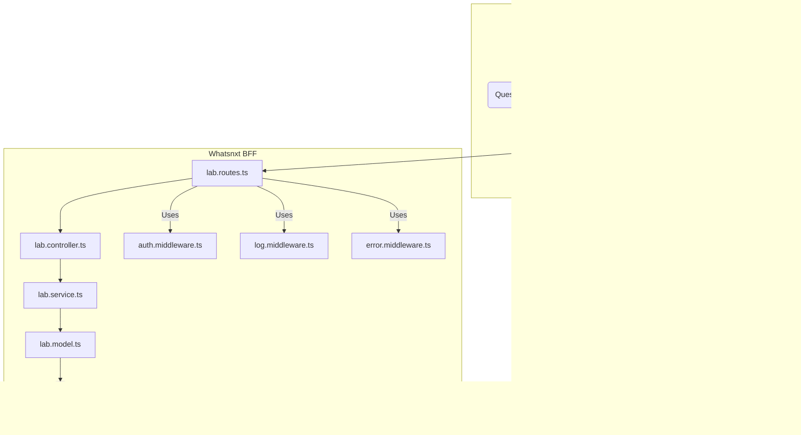

```mermaid
graph TD
    subgraph Browser
        A[LabCreationPage] --> B(QuestionEditor);
        A --> C(DiagramEditor);
        C --> D(DiagramCanvas);
        C --> E(ShapePalette);
        A --> F{API Client};
    end
    subgraph Whatsnxt BFF
        G[lab.routes.ts] --> H[lab.controller.ts];
        H --> I[lab.service.ts];
        I --> J[lab.model.ts];
        J --> K[(MongoDB)];
        M[auth.middleware.ts];
        N[log.middleware.ts];
        O[error.middleware.ts];
    end
    F --> G;
    G -- Uses --> M;
    G -- Uses --> N;
    G -- Uses --> O;
```
