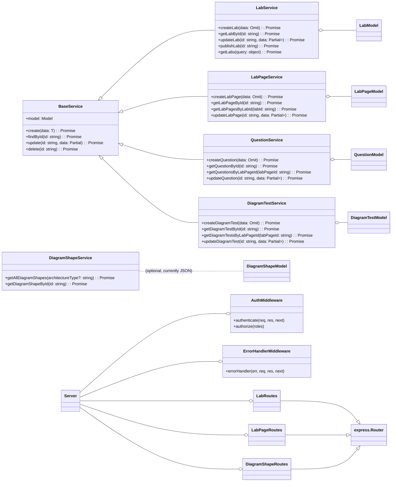

# Low-Level Design (LLD): Lab Diagram Tests Feature

## 1. Introduction

This document details the low-level design of the Lab Diagram Tests feature, focusing on the internal structure, classes, and function-level interactions within the backend and a conceptual overview for the frontend.

## 2. Backend (apps/whatsnxt-bff)

### 2.1. Directory Structure

```
apps/whatsnxt-bff/
├── app/
│   ├── models/           # Mongoose schemas and models
│   │   ├── lab.model.ts
│   │   ├── labpage.model.ts
│   │   ├── question.model.ts
│   │   ├── diagramtest.model.ts
│   │   └── diagramshape.model.ts
│   ├── services/         # Business logic and CRUD operations
│   │   ├── base.service.ts
│   │   ├── lab.service.ts
│   │   ├── labpage.service.ts
│   │   ├── question.service.ts
│   │   ├── diagramtest.service.ts
│   │   └── diagramshape.service.ts
│   ├── routes/           # Express.js route definitions
│   │   ├── lab.routes.ts
│   │   ├── labpage.routes.ts
│   │   └── diagramshape.routes.ts
│   ├── errors/           # Custom error handling middleware
│   │   └── errorHandler.ts
│   ├── middleware/       # Authentication and authorization middleware
│   │   └── auth.ts
│   └── utils/            # General utility functions
│       └── encryption.ts
├── config/               # Configuration files
│   ├── logger.ts
│   └── httpClient.ts
├── tests/
│   ├── unit/
│   │   ├── lab.service.test.ts
│   │   ├── labpage.service.test.ts
│   │   ├── question.service.test.ts
│   │   ├── diagramtest.service.test.ts
│   │   └── diagramshape.service.test.ts
│   └── integration/
│       └── lab.routes.test.ts
└── server.ts             # Main Express application entry point
```

### 2.2. Class Diagram (Simplified)



## 3. Frontend (apps/web) - Conceptual

### 3.1. Components

-   **`LabCreator.tsx`**: Form for creating new labs, handles input validation and API calls to `POST /api/v1/labs`.
-   **`LabPageCreator.tsx`**: Multi-step form for creating and configuring lab pages. Integrates `QuestionEditor` and `DiagramTestEditor`. Makes API calls to `POST /api/v1/labs/:labId/pages` and `PUT /api/v1/labs/:labId/pages/:pageId`.
-   **`QuestionEditor.tsx`**: UI for defining question text, type (MCQ/Text), options, and correct answers.
-   **`DiagramTestEditor.tsx`**: UI for setting diagram test prompts, selecting architecture types, displaying available shapes, and conceptually interacting with a diagramming canvas. Fetches shapes from `GET /api/v1/diagram-shapes`.

### 3.2. API Integration

-   **`apps/web/apis/lab.api.ts`**: Centralized module for all API calls related to labs, pages, questions, diagram tests, and shapes. Uses `@whatsnxt/http-client` (mocked as `mockApiClient` for now) for consistent HTTP requests, including retry logic and error handling.
-   **`apps/web/utils/errorHandler.ts`**: Frontend-specific error handling utility for displaying user-friendly notifications and logging client-side errors.

### 3.3. State Management

-   React's local state (`useState`, `useReducer`) and potentially React Context or a global state manager (e.g., Zustand, Jotai) for more complex lab creation workflows.

## 4. Cross-Cutting Concerns

-   **Error Handling**: Backend uses `errorHandler.ts` with `@whatsnxt/errors` custom error classes. Frontend uses `handleClientError` to display notifications.
-   **Logging**: Winston logger (`config/logger.ts`) for backend.
-   **Security**: Authentication (`authenticate` middleware) and Authorization (`authorize` middleware) implemented in `middleware/auth.ts`. Data encryption utilities in `utils/encryption.ts` for sensitive data at rest.
-   **Resilience**: `config/httpClient.ts` in backend configures retry mechanisms for external calls.
-   **Code Quality**: ESLint with cyclomatic complexity rules.