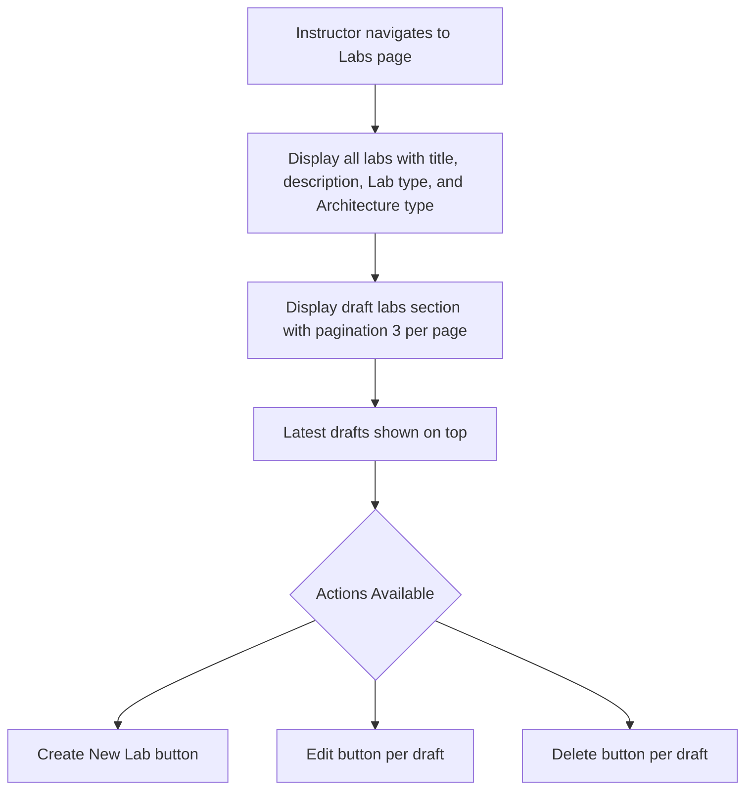
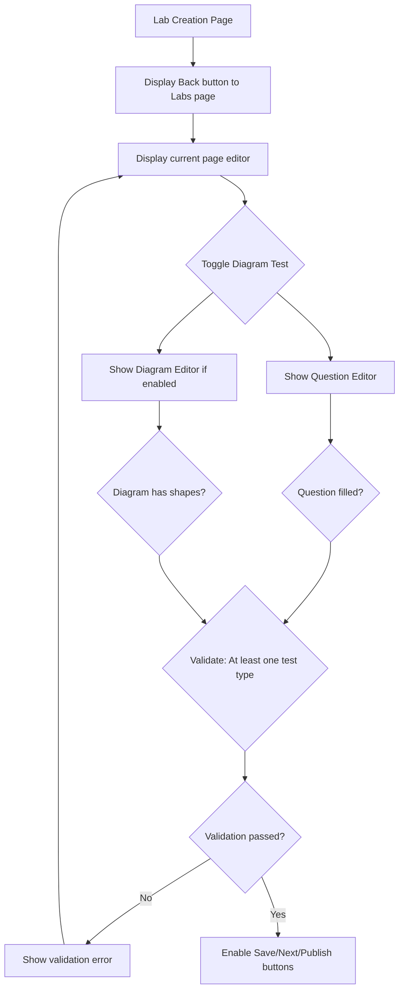
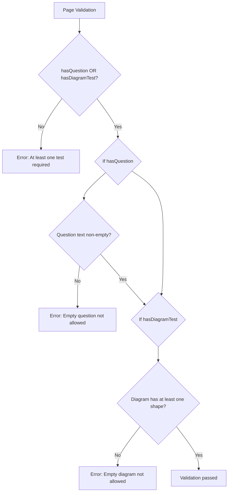

# User Flow Diagrams: Lab Diagram Tests Feature

## 1. Introduction

This document provides visual representations of key user journeys within the Lab Diagram Tests feature, focusing on the instructor's perspective.

## 2. User Story 1: Instructor Manages Lab Drafts

**Goal**: An instructor views, creates, edits, and deletes lab drafts from the Labs page.

### 2.1. Flow: View Labs Page



### 2.2. Flow: Create New Lab

```mermaid
graph TD
    A[Instructor on Labs page] --> B{Click "Create New Lab"};
    B --> C[Navigate to Lab Creation page];
    C --> D[Fill Lab Name, Description, Lab Type, Architecture Type];
    D --> E[Display initial page editor];
    E --> F[Lab Created as Draft];
```

### 2.3. Flow: Edit Draft Lab

```mermaid
graph TD
    A[Instructor views draft lab item] --> B{Click "Edit" button};
    B --> C[Navigate to Lab Creation page];
    C --> D[Load draft data pre-filled];
    D --> E[Instructor modifies lab content];
    E --> F[Save changes as draft];
```

### 2.4. Flow: Delete Draft Lab

```mermaid
graph TD
    A[Instructor views draft lab item] --> B{Click "Delete" button};
    B --> C{Confirmation dialog};
    C --> D{If confirmed};
    D --> E[Delete draft from database];
    E --> F[Display success message];
    F --> G[Refresh labs list];
```

## 3. User Story 2: Instructor Creates a Lab with Questions and Diagrams

**Goal**: An instructor creates a new multi-page lab that includes both standard questions and interactive diagramming exercises, saves it as a draft, and then publishes it.

### 3.1. Flow: Lab Creation Page - Add/Edit Lab Pages



### 3.2. Flow: Save Page and Navigate

```mermaid
graph TD
    A[Instructor on Lab Creation Page] --> B{Click "Next" button};
    B --> C{Validate current page};
    C -->|Validation fails| D[Show validation error];
    C -->|Validation passes| E[Save current page as draft];
    E --> F[Navigate to next page];
    F --> G[New page editor displayed];
    D --> A;
```

### 3.3. Flow: Save as Draft

```mermaid
graph TD
    A[Instructor on Lab Creation Page] --> B{Click "Save as Draft" button};
    B --> C{Validate: At least one page with valid tests};
    C -->|Validation fails| D[Show validation error];
    C -->|Validation passes| E[Save all changes as draft];
    E --> F[Display success message];
    F --> G{Stay on page or navigate};
    D --> A;
```

### 3.4. Flow: Publish Lab

```mermaid
graph TD
    A[Lab Creation Page (Draft Status)] --> B{Click "Publish" button};
    B --> C{Validate: At least one page with valid tests};
    C -->|Validation fails| D[Show validation error];
    C -->|Validation passes| E{Confirmation Dialog};
    E --> F{If Confirm};
    F --> G[Lab Status changed to "Published"];
    G --> H[Published Lab Accessible to Students];
    H --> I{If Published Lab is Edited: New Draft Version Created};
    D --> A;
```

### 3.5. Flow: Validation Rules



## 4. Other Implicit Flows

-   **Viewing Lab (Student)**: Student navigates to published lab, interacts with questions and diagram tests.
-   **Editing Published Lab**: Instructor edits a published lab, triggering creation of a new draft.
-   **Pagination Navigation**: Instructor navigates between pages of draft labs (3 per page).
-   **Back Navigation**: Instructor clicks Back button on Lab Creation page to return to Labs page.

## 5. API Contract Summary

The following APIs must be implemented to support the user flows:

### Labs Page APIs
- `GET /api/v1/labs?status=draft&page=1&limit=3` - Get paginated draft labs
- `GET /api/v1/labs?status=published` - Get published labs
- `POST /api/v1/labs` - Create new lab (returns draft lab with ID)
- `DELETE /api/v1/labs/:labId` - Delete draft lab

### Lab Creation Page APIs
- `GET /api/v1/labs/:labId` - Get lab details for editing
- `PUT /api/v1/labs/:labId` - Update lab metadata (name, description, labType, architectureType)
- `POST /api/v1/labs/:labId/pages` - Create new lab page
- `PUT /api/v1/labs/:labId/pages/:pageId` - Update lab page
- `POST /api/v1/labs/:labId/publish` - Publish lab

### Diagram Shapes APIs
- `GET /api/v1/diagram-shapes?architectureType=AWS` - Get shapes by architecture type
- `GET /api/v1/diagram-shapes?architectureType=Common` - Get common shapes

All APIs must:
- Use real backend services (no mock data)
- Return proper error responses with validation messages
- Support proper authentication and authorization
