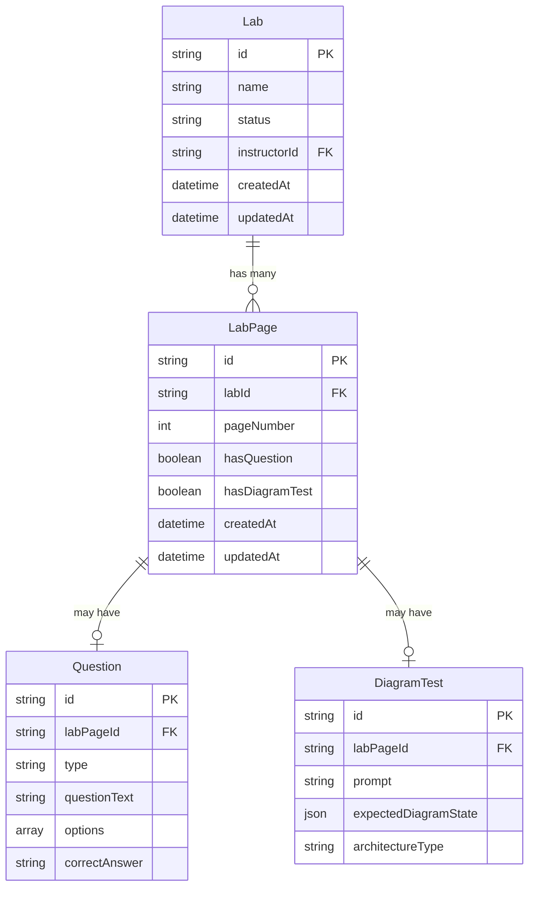
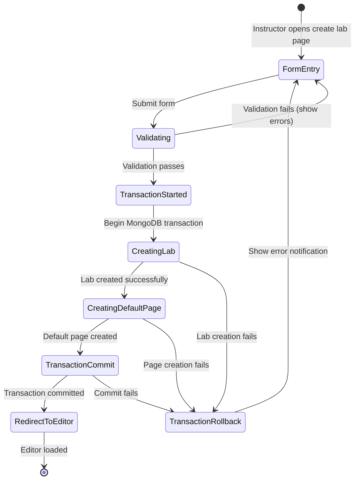
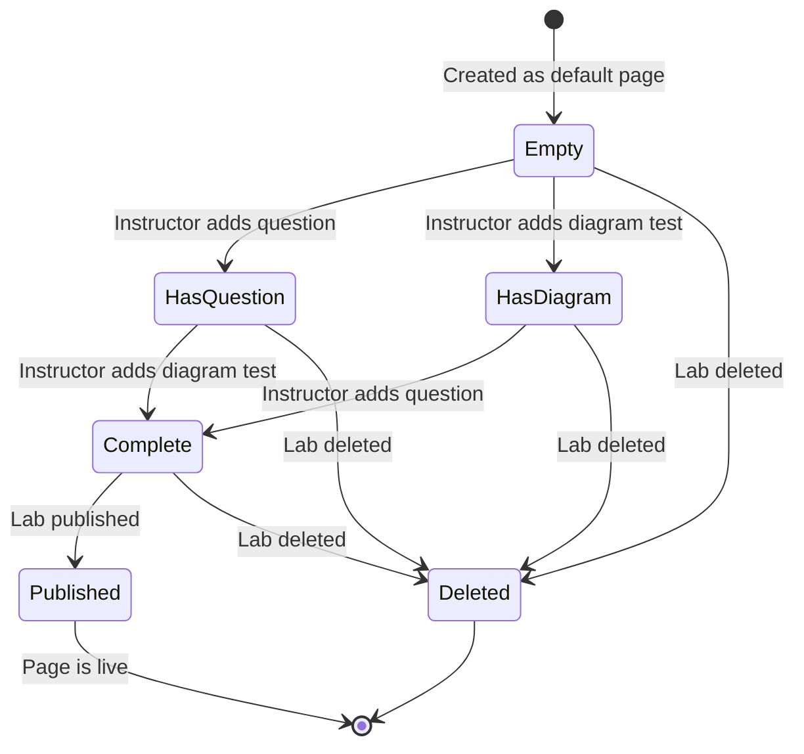

# Data Model: Streamline Lab Creation Flow

**Date**: 2026-01-11  
**Status**: Complete  
**Phase**: Phase 1 - Design & Contracts

## Overview

This document defines the data entities, relationships, and validation rules for the streamlined lab creation flow. The feature reuses existing Lab and LabPage entities with minimal modifications.

---

## Entity Definitions

### Lab Entity

**Source**: `packages/core-types/src/index.d.ts`

```typescript
interface Lab extends BaseEntity {
  id: string;
  status: 'draft' | 'published';
  name: string;
  description?: string;
  labType: string;
  architectureType: string;
  instructorId: string;
  associatedCourses?: string[];
  pricing?: any;
  createdAt: Date;
  updatedAt: Date;
}
```

**No Schema Changes Required**

**New Transient Field** (API response only, not persisted):
```typescript
interface LabCreationResponse extends Lab {
  defaultPageId?: string; // ID of the auto-created default page
}
```

**Validation Rules**:
- `name`: Required, non-empty string, max 200 characters
- `labType`: Required, non-empty string
- `architectureType`: Required, non-empty string
- `instructorId`: Required, valid UUID
- `status`: Defaults to 'draft' on creation
- `pricing`: Optional, validated by LabPricingForm component

---

### LabPage Entity

**Source**: `packages/core-types/src/index.d.ts`

```typescript
interface LabPage extends BaseEntity {
  id: string;
  labId: string;
  pageNumber: number;
  hasQuestion: boolean;
  hasDiagramTest: boolean;
  question?: Question;
  diagramTest?: DiagramTest;
  createdAt: Date;
  updatedAt: Date;
}
```

**No Schema Changes Required**

**Default Page Values**:
```typescript
{
  labId: string;        // Reference to parent Lab
  pageNumber: 1;        // Always 1 for default page
  hasQuestion: false;   // Initially empty
  hasDiagramTest: false; // Initially empty
}
```

**Validation Rules**:
- `labId`: Required, must reference existing Lab.id
- `pageNumber`: Required, must be 1 for default page
- `hasQuestion`: Required boolean, defaults to false
- `hasDiagramTest`: Required boolean, defaults to false
- `question`: Optional, populated when instructor adds question
- `diagramTest`: Optional, populated when instructor adds diagram test

**Constraints**:
- Unique constraint on `(labId, pageNumber)` pair
- `pageNumber` must be >= 1
- Cannot delete default page (pageNumber=1) if it's the only page

---

## Entity Relationships



**Relationship Rules**:
- One Lab has one or more LabPages (minimum 1 after creation)
- One LabPage belongs to exactly one Lab
- One LabPage may have zero or one Question
- One LabPage may have zero or one DiagramTest
- Deleting a Lab cascades to delete all associated LabPages
- Creating a Lab automatically creates exactly one default LabPage (pageNumber=1)

---

## State Transitions

### Lab Creation State Flow



**State Descriptions**:

1. **FormEntry**: User fills out lab creation form
2. **Validating**: Frontend validates required fields
3. **TransactionStarted**: MongoDB session begins transaction
4. **CreatingLab**: Lab document inserted into database
5. **CreatingDefaultPage**: LabPage document inserted (pageNumber=1)
6. **TransactionCommit**: Transaction committed atomically
7. **RedirectToEditor**: Frontend redirects to page editor
8. **TransactionRollback**: Any failure rolls back entire transaction

---

### Lab Page Lifecycle



**State Rules**:
- Pages start in Empty state (no question, no diagram)
- Pages can have question only, diagram only, or both
- Pages can be deleted only if not the last page in lab
- Published pages cannot be deleted (unpublish lab first)

---

## Validation Rules Summary

### Lab Entity Validation

| Field | Validation Rule | Error Message |
|-------|----------------|---------------|
| name | Required, non-empty, max 200 chars | "Lab name is required" |
| labType | Required, non-empty | "Lab type is required" |
| architectureType | Required, non-empty | "Architecture type is required" |
| instructorId | Required, valid UUID | "Invalid instructor ID" |
| pricing.price | If paid: 10 ≤ price ≤ 100,000 | "Price must be between ₹10 and ₹100,000" |

### LabPage Entity Validation

| Field | Validation Rule | Error Message |
|-------|----------------|---------------|
| labId | Required, must exist in Lab collection | "Lab not found" |
| pageNumber | Required, >= 1, unique within lab | "Invalid page number" |
| hasQuestion | Required boolean | "hasQuestion flag required" |
| hasDiagramTest | Required boolean | "hasDiagramTest flag required" |

---

## Database Indexes

### Existing Indexes (Assumed)

```javascript
// Lab collection
Lab.createIndex({ id: 1 }, { unique: true });
Lab.createIndex({ instructorId: 1 });
Lab.createIndex({ status: 1 });

// LabPage collection
LabPage.createIndex({ id: 1 }, { unique: true });
LabPage.createIndex({ labId: 1, pageNumber: 1 }, { unique: true });
LabPage.createIndex({ labId: 1 });
```

**No New Indexes Required**

**Query Performance**:
- Finding default page: `LabPage.findOne({ labId, pageNumber: 1 })` uses compound index
- Listing lab pages: `LabPage.find({ labId })` uses labId index
- Transaction queries: All indexed, <50ms expected

---

## Data Integrity Constraints

### Atomicity Constraint

**Requirement**: Lab and default LabPage must be created atomically.

**Implementation**:
```javascript
const session = await mongoose.startSession();
session.startTransaction();

try {
  const lab = await Lab.create([labData], { session });
  const page = await LabPage.create([{
    labId: lab[0].id,
    pageNumber: 1,
    hasQuestion: false,
    hasDiagramTest: false
  }], { session });
  
  await session.commitTransaction();
  return { lab: lab[0], page: page[0] };
} catch (error) {
  await session.abortTransaction();
  throw error;
} finally {
  session.endSession();
}
```

**Guarantee**: Either both documents are created, or neither is created.

---

### Referential Integrity

**Constraints**:
1. `LabPage.labId` must reference existing `Lab.id`
2. Deleting a Lab must cascade delete all associated LabPages
3. Cannot delete the last LabPage of a Lab

**Implementation** (MongoDB middleware):
```javascript
// Pre-delete hook on Lab model
LabSchema.pre('deleteOne', async function(next) {
  const labId = this.getQuery()._id;
  await LabPage.deleteMany({ labId });
  next();
});

// Pre-delete hook on LabPage model
LabPageSchema.pre('deleteOne', async function(next) {
  const page = await this.model.findOne(this.getQuery());
  const pagesCount = await LabPage.countDocuments({ labId: page.labId });
  
  if (pagesCount === 1) {
    throw new Error('Cannot delete the last page of a lab');
  }
  next();
});
```

---

### Uniqueness Constraints

**Constraints**:
1. `Lab.id` must be unique (UUID)
2. `LabPage.id` must be unique (UUID)
3. `(LabPage.labId, LabPage.pageNumber)` pair must be unique

**Implementation**: Database unique indexes + validation in service layer

---

## Edge Cases and Handling

### Concurrent Lab Creation

**Scenario**: Instructor submits form multiple times rapidly.

**Handling**:
- Frontend disables submit button after first click (`isSubmitting` state)
- Backend generates unique UUIDs for each request
- No risk of duplicate labs (different IDs)

### Transaction Timeout

**Scenario**: Database transaction takes too long (network issue).

**Handling**:
- MongoDB transaction timeout: 60 seconds default
- Frontend request timeout: 30 seconds
- User sees error: "Request timeout, please try again"
- No partial data created (transaction auto-rollback)

### Database Connection Lost

**Scenario**: Database connection drops during transaction.

**Handling**:
- MongoDB driver auto-retries connection
- Transaction fails and rolls back automatically
- User sees error: "Connection failed, please try again"
- No partial data created

### Validation Error on Page Creation

**Scenario**: Lab creation succeeds, but page validation fails (unlikely).

**Handling**:
- Transaction rolls back automatically
- No lab created in database
- User sees error: "Failed to create lab, please try again"

### Default Page Already Exists

**Scenario**: Race condition where default page is created twice (nearly impossible with transactions).

**Handling**:
- Unique index on `(labId, pageNumber)` prevents duplicate
- Second insert fails, transaction rolls back
- User retries and succeeds

---

## Migration Requirements

**No migration required.**

- Existing Labs continue to work without default pages
- New Labs get default pages automatically
- No schema changes to existing entities
- Backward compatible with all existing data

---

## Data Access Patterns

### Create Lab with Default Page

```javascript
// Service: apps/whatsnxt-bff/app/services/lab.service.js
async function createLabWithDefaultPage(labData) {
  const session = await mongoose.startSession();
  session.startTransaction();
  
  try {
    const lab = await Lab.create([{
      ...labData,
      status: 'draft',
      createdAt: new Date(),
      updatedAt: new Date()
    }], { session });
    
    const defaultPage = await LabPage.create([{
      labId: lab[0].id,
      pageNumber: 1,
      hasQuestion: false,
      hasDiagramTest: false,
      createdAt: new Date(),
      updatedAt: new Date()
    }], { session });
    
    await session.commitTransaction();
    
    return {
      ...lab[0].toObject(),
      defaultPageId: defaultPage[0].id
    };
  } catch (error) {
    await session.abortTransaction();
    throw error;
  } finally {
    session.endSession();
  }
}
```

### Get Lab with Pages

```javascript
// Service: apps/whatsnxt-bff/app/services/lab.service.js
async function getLabById(labId) {
  const lab = await Lab.findById(labId);
  if (!lab) throw new NotFoundError('Lab not found');
  
  const pages = await LabPage.find({ labId })
    .sort({ pageNumber: 1 })
    .lean();
  
  return { ...lab.toObject(), pages };
}
```

### Get Default Page

```javascript
// Service: apps/whatsnxt-bff/app/services/labPage.service.js
async function getDefaultPage(labId) {
  const page = await LabPage.findOne({ 
    labId, 
    pageNumber: 1 
  }).lean();
  
  if (!page) throw new NotFoundError('Default page not found');
  return page;
}
```

---

## Performance Expectations

| Operation | Expected Time | Constraint |
|-----------|---------------|------------|
| Create Lab + Default Page | <500ms | Transaction + 2 inserts |
| Get Lab by ID | <100ms | Indexed query |
| Get Default Page | <50ms | Compound index query |
| List Lab Pages | <100ms | Indexed query + sort |

**Database Load**:
- Additional writes per lab creation: +1 (default page)
- Additional reads: None (pages already queried)
- Storage overhead: ~500 bytes per default page

---

## Summary

- **No schema changes** to Lab or LabPage entities
- **Atomic creation** using MongoDB transactions
- **Minimal performance impact** (<500ms total)
- **Backward compatible** with existing data
- **Clear validation rules** for data integrity
- **Efficient indexing** for fast queries
- **Comprehensive edge case handling**

---

## Next Steps

Proceed to API contract generation in `/contracts/` directory.
